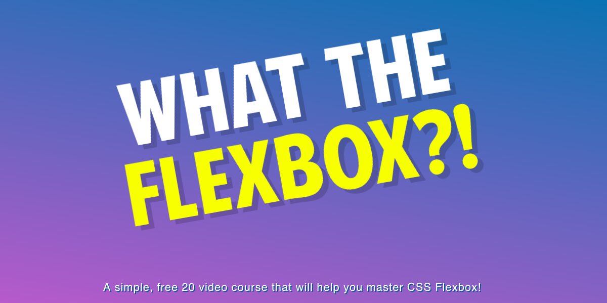

# Flexbox Video Course - [@wesbos](https://github.com/wesbos)

What The Flexbox?! — A simple 20 video course that will help you master CSS Flexbox

Grab the course at [https://flexbox.io](https://flexbox.io)
Github official the course at [https://github.com/wesbos/What-The-Flexbox](https://github.com/wesbos/What-The-Flexbox)

### **_Observations_**
_Some exercises within your directory have a file called **package.json**. If it have this file, you must have **npm** installed and execute the commands:_

```
$ npm install
$ npm start
```


## List of Exercises

* [01-IntroductionToFlexbox](https://herminiotorres.github.io/cssgrid/01-IntroductionToFlexbox/finish.html)
* [02-WorkingWithFlexboxFlex-Direction](https://herminiotorres.github.io/cssgrid/02-WorkingWithFlexboxFlex-Direction/finish.html)
* [03-WrappingElementsWithFlexbox](https://herminiotorres.github.io/cssgrid/03-WrappingElementsWithFlexbox/finish.html)
